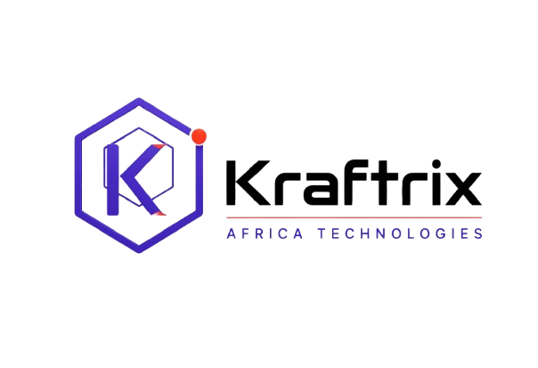

<div align="center">

<!-- HEADER BANNER -->


<!-- PROFILE PHOTO -->
<br/>


<br/>

<!-- TYPING SVG -->
<a href="https://git.io/typing-svg">
  
</a>

<br/><br/>

<!-- SOCIAL BADGES -->
[](https://kraftrix-africa.vercel.app/)
[](https://linkedin.com/in/brian-mwalish-7a746a306)
[](mailto:brianmwalish@gmail.com)
[](https://github.com/Brian2021-Mwalish)
[](https://github.com/Brian2021-Mwalish)

</div>

---

## 🧬 About Me

```python
class Brian:
    name        = "Brian Mwalish"
    location    = "Eldoret, Kenya 🇰🇪"
    role        = "Application Solutions Specialist"
    focus       = ["AI/ML Engineering", "Full-Stack Development", "SaaS Automation", "UI/UX Design"]
    languages   = ["Python", "PHP", "C++", "SQL", "JavaScript"]
    frameworks  = ["Django", "FastAPI", "React", "TensorFlow", "PyTorch"]
    tools       = ["Docker", "Figma", "Firebase", "PostgreSQL", "Linux", "AWS"]
    currently   = "Building AI-powered restaurant & developer tooling platforms"
    mission     = "Turn complex problems into elegant, scalable solutions."

    def __str__(self):
        return f"Engineer who ships things that matter. 🚀"
```

> From curiosity-driven scripting to AI-powered SaaS platforms — I build systems that are **fast**, **intelligent**, and **beautiful**. Currently working at the intersection of **restaurant technology**, **artificial intelligence**, and **developer tooling**.

---

## 🛠️ Tech Stack

<div align="center">

### ◈ Languages & Frameworks


### ◈ AI / ML


### ◈ Infrastructure & Design


</div>

---

## 🚀 Featured Projects

<div align="center">

| Project | Stack | Description | Status |
|:--------|:------|:------------|:------:|
| 🍽️ **SmartTable** | Django · React · PostgreSQL · AI | AI-powered restaurant seating optimizer with 100+ active users |  |
| 🧠 **AI Classifier** | TensorFlow · Streamlit | Real-time image recognition engine — 95%+ accuracy |  |
| 📚 **Book Buddy** | Flask · SQLite | Smart digital library management system |  |
| ✍️ **DevJournal** | Django · CKEditor | Markdown-powered blog platform for developers |  |
| 🎨 **Portfolio 2.0** | Tailwind · GSAP | Interactive glassmorphic personal portfolio |  |

</div>

---

## 📊 GitHub Stats

<div align="center">
  
  
</div>

<div align="center">
  
</div>

---

## 📈 Contribution Graph

<div align="center">
  
</div>

---

## 🏆 Achievements & Milestones

<div align="center">

| 🏅 Milestone | 🔢 Count |
|:------------|:--------:|
| ⭐ GitHub Stars (Open Source) | **500+** |
| 👥 SmartTable Active Users | **100+** |
| 🎓 Developers Mentored | **20+** |
| 📜 Cloud Certifications | **2** (AWS · Kubernetes) |
| 💼 SaaS Products Shipped | **5+** |

</div>

---

## 🗺️ 2025 Roadmap

```
◈ [ ] 🚀  Launch 5+ SaaS platforms
◈ [ ] 🐳  Master Kubernetes & CI/CD pipelines
◈ [ ] 📦  Publish open-source libraries & tutorials
◈ [ ] 👨‍🏫  Grow developer communities across East Africa
◈ [ ] 📱  Ship a Flutter mobile app
◈ [ ] 🤖  Deploy production-grade LLM-powered agents
```

---

## 📚 Currently Learning

<div align="center">


</div>

---

## 🌍 Community & Impact

<div align="center">

| Role | Organization |
|:-----|:------------|
| 👨‍🏫 Mentor | DjangoGirls Lusaka |
| 💻 Open-Source Contributor | Django & React Ecosystems |
| ✍️ Technical Writer | Medium & Dev.to |
| 🎙️ Speaker | Local Tech & AI Meetups |

</div>

---

## 💬 Let's Connect

<div align="center">

Have a project in mind? Want to collaborate or just talk tech?

[](https://kraftrix-africa.vercel.app/)
[](https://linkedin.com/in/brian-mwalish-7a746a306)
[](mailto:brianmwalish@gmail.com)

<br/>

> *"First, solve the problem. Then, write the code."* — John Johnson

<br/>

</div>

<!-- FOOTER BANNER -->
